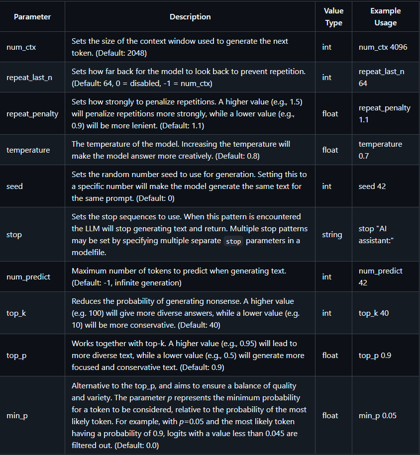

# 🧠 LangChain + Ollama Local Agentic Systems

> Build, customize, and experiment with LangChain-powered agents running local LLMs through Ollama!

---

## 📘 Overview

**LangChain** is a powerful Python framework for building agentic systems using LLMs. It enables abstraction of components, making it easier to construct agents, chains, memory-aware conversations, and more. This abstraction extends across the LangChain ecosystem including:

- **LangGraph**: Graph-based reasoning framework.
- **LangSmith**: LLM observability and debugging tool.
- **LangFlow**: Visual editor for LangChain apps.
- **LangServe**: Server-ready LangChain deployments.

In this project, we'll walk through setting up a LangChain project using the **Ollama** Python library to run LLMs locally and customize agent behavior.

---

## 🚀 Project Setup

We'll use [`uv`](https://github.com/astral-sh/uv), a fast Python package and environment manager written in Rust.

### 🧰 Installation Steps

1. **Initialize the project**:
   ```bash
   uv init langchain-agents
   ```

2. **Create a virtual environment**:

   ```bash
   uv venv --python 3.12.7
   ```

   👉 To see all Python versions on your system:

   ```bash
   uv python list
   ```

3. **Activate the virtual environment**:

   ```bash
   source .venv/bin/activate
   ```

4. **Install dependencies**:

   ```bash
   uv add \
     langchain-core langchain-ollama langsmith docarray \
     langchain-community ipykernel langchain \
     fastapi uvicorn google-search-results ollama
   ```

5. **Install Ollama**:

   * Follow the [official installation guide](https://github.com/ollama/ollama-python).
   * **If using WSL**:

     ```bash
     curl -fsSL https://ollama.com/install.sh | sh
     ```

6. **Pull a model** (e.g., Qwen 0.6b):

   ```bash
   ollama pull qwen3:0.6b
   ```

7. **Test the setup**:

   ```bash
   uv run ollama_basics.py
   ```

---

## 🧪 Ollama Configuration Tips

🧰 You can find more advanced model options and configuration settings in the [Ollama REST API Docs](https://github.com/ollama/ollama/blob/main/docs/api.md).



---

## 🖥️ VS Code + WSL Quick Fixes

* ✅ **Interpreter selection**:

  * `Ctrl + Shift + P` → "Python: Select Interpreter"
  * Enter path: `.venv/bin/python`, or use `python3` or `python3.12`

* 🔄 **Reload Window**:

  * `Ctrl + Shift + P` → "Reload Window"

---

## ⚠️ Model Selection Note

We're using non-instruction-tuned models like **DeepSeek-R1** and **Qwen3**, which can lead to unpredictable or incoherent outputs.

👉 It’s **highly recommended** to use **instruction-tuned models** like **Llama3** for more reliable and contextual responses.

---


### 🧱 LangChain Core

Foundation layer that provides abstractions for:

* Prompts
* Memory
* Chains
* Tools
* Agents

---

## ✍️ Prompt Basics

LangChain recognizes three prompt types:

1. **System Prompt** 🧠
   Provides role and behavior for the LLM (e.g., “You are a helpful assistant…”)

2. **User Prompt** 👤
   Carries the task or question from the user.

3. **AI Prompt** 🤖
   LLM’s generated response to the user.

LangChain offers templates to compose and manage these prompt types effectively.

---

## 🧪 LangSmith

A debugging, testing, and observability tool for LLM applications.

* Monitors how your agents behave
* Tracks prompts, outputs, and traces
* Requires an API key (free tier available)

---

## 💬 Prompting Strategy

An effective prompt contains:

1. **Rules**: Behavior definition for the model.
2. **Context**: External info (a.k.a. Retrieval-Augmented Generation).
3. **Question**: What the user wants.
4. **Answer**: What the LLM returns.

---

## 🧠 Chat Memory in LangChain

LLMs don’t retain previous inputs by default. LangChain provides memory wrappers to retain conversation history.

### 🧠 Memory Types

| Type                              | Description                                 |
| --------------------------------- | ------------------------------------------- |
| `ConversationBufferMemory`        | Stores all past messages in memory.         |
| `ConversationBufferWindowMemory`  | Retains only the last N messages.           |
| `ConversationSummaryMemory`       | Summarizes entire conversation history.     |
| `ConversationSummaryBufferMemory` | Mix of buffer + summary using token limits. |

⚠️ Some of these are deprecated — prefer using `RunnableWithMessageHistory`.

---

## 🛠 Agents in LangChain

Agents enhance LLMs by allowing tool usage (e.g., search, calculators, databases).

🔧 **Key points when defining tools**:

* Use docstrings to explain when and why the tool should be used.
* Provide self-explanatory argument names.
* Add clear type annotations for both input and output.

Example:

```python
def get_weather(city: str) -> str:
    """Gets current weather for the provided city."""
    ...
```

---

## 🧬 LangChain Expression Language (LCEL)

LCEL allows composing LLM chains declaratively and functionally — similar to RxJS or functional streams.

✅ Ideal for:

* Chaining prompts
* Handling memory
* Creating reusable LLM components
